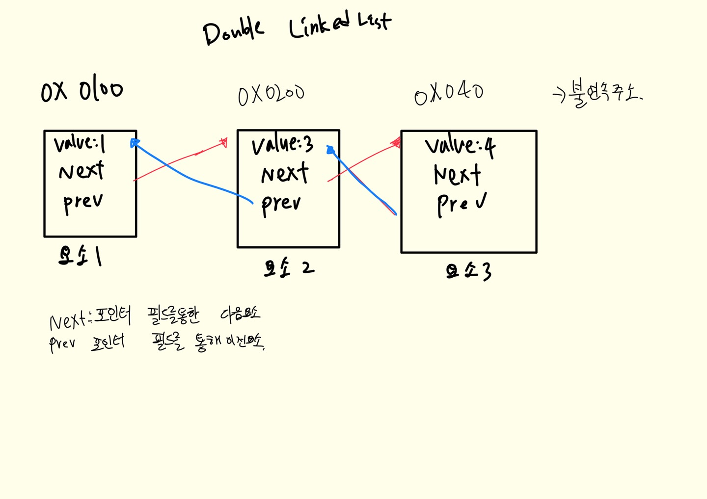
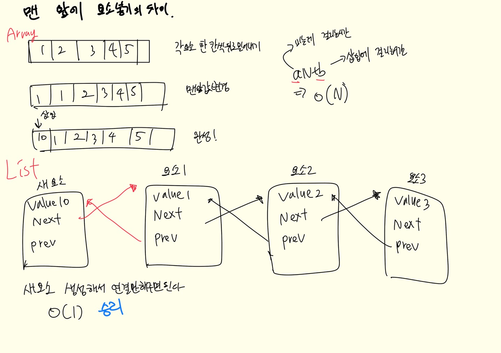
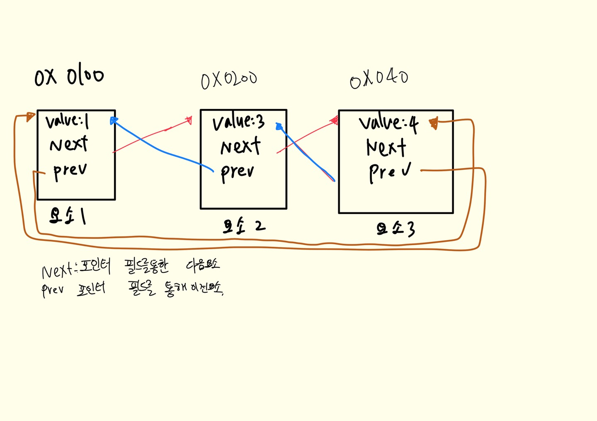

## Go로 다시 공부하는 자료구조

Go언어를 배우면서 자료구조적 사고를 다시 복습하자!
트러커 프로그래머의 Go로 배우는 자료구조 유튜브
### 복습

어레이는 연속되고 링크드 리스트는 불연속 방식이다
자료구조 뭐잇더라 ? -> 배열 리스트 트리 맵 등등등

리스트 : 가장 기본적인 선형자료구조~ 

선형? 하나에 하나씩~ 비선형? 하나에 여러개씩! 트리는 root에서 차일드로 뻗어나갓엇죠 그런게 이제 비선형구조
파일구조가 보통 트리구조

Go의 리스트는 구조체로 구현됩니당

type Element struct {
    Value interface{} 
    Next *Element
    Prev *Element
}

빅오! -> 알고리즘효율성 표기법~ 상한선 표기
공간을 많이 쓰면 시간이 줄어들고 공간을 조금 쓰면 시간이 늘어나겠죠 메모리와 작업시간.

배열 vs 리스트

배열에서 맨 앞에 요소 삽입하려면 O(N) 알고리즘 ...
요소 삽입이나 삭제가 많으면~ 리스트가 유리하고~ 랜덤 접근이 많다면 배열이 유리하다.

데이터의 지역성  
데이터가 인접해 있을 수록 캐시의 성공률이 올라가고 성능도 증가하게 된다.  
일반적으로 요소 수가 적은경우에 리스트보다 배열이 빠르다.  
1000개 까지는 무난히 배열이 빠르고? 만개 부터는 고민을 해봐야한다.  
랜덤액세스가 많다? 무조건 배열 삽입/삭제 많다? 리스트인데 요소수도 고려해봐야죠.

큐! 선입선출~(FIFO)  
파이프라고생각하면되는거죠오
대기열 만들때 쓰이죠?

Stack 스택 나서스... 쌓다  
선입 후출이죠 (FILO)  
원통 구조죠.

Ring : 링은 마지막 요소가 처음요소로 다시 연결된 형태의 구조!

링은 언제쓰나? 일정한 갯수만 사용하고 오래된 요소가 지워져도 되는경우  
문서 편집기 고정 크기 버퍼 리플레이

실행 취소의 기능 : 문서 편집기 등에서 일정한 개수의 명령을 저장하고 실행 취소하는 경우  
고정 크기 버퍼 기능 : 데이터에 따라 버퍼가 증가되지 않고 고정 길이를 사용할 경우  
리플레이 기능 : 게임등에서 최근 플레이 10초를 다시 리플레이 할때와 같이 고정된 길이의 리플레이 기능의 제공  
